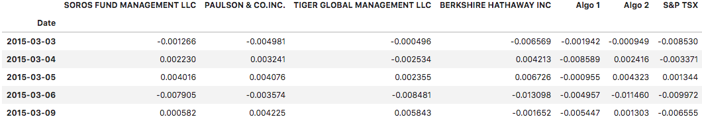

# A Whale Off the Port(folio)

## Background

Harold's company has been investing in algorithmic trading strategies. Some of the investment managers love them, some hate them, but they all think their way is best.

We just learned these quantitative analysis techniques with Python and Pandas, so Harold has come to us with a challenge—to help him determine which portfolio is performing the best across multiple areas: volatility, returns, risk, and Sharpe ratios.

We need to create a tool (an analysis notebook) that analyzes and visualizes the major metrics of the portfolios across all of these areas, and determine which portfolio outperformed the others. 

### **Files that we are using to prepare the data**

* [Portfolio Analysis](portfolio-analysis.ipynb)

* [algo_returns.csv](Resources/algo_returns.csv)

* [otex_historical.csv](Resources/otex_historical.csv)

* [sp_tsx_history.csv](Resources/sp_tsx_history.csv)

* [l_historical.csv](Resources/l_historical.csv)

* [shop_historical.csv](Resources/shop_historical.csv)

* [whale_returns.csv](Resources/whale_returns.csv)

### Conduct Quantitative Analysis

Below We analyzed the data to see if any of the portfolios outperform the stock market (i.e., the S&P TSX).

#### Performance Analysis

1. Calculate and plot cumulative returns. **Does any portfolio outperform the S&P TSX?**

> Yes, `Algo 1` followed by `BERKSHIRE HATHAWAY INC`.

#### Risk Analysis

1. Create a box plot for each of the returns and Calculate the standard deviation for each portfolio. **Which portfolios are riskier than the S&P TSX 60?**

> `TIGER GLOBAL MANAGEMENT LLC`    
> `BERKSHIRE HATHAWAY INC`        

#### Rolling Statistics

1. Calculate and plot the rolling standard deviation for all portfolios using a 21-day window. 

2. Construct a correlation between each stock to determine which portfolios may mimick the S&P TSX 60. **Which returns most closely mimic the S&P?**

> `Algo 2` & `SOROS FUND MANAGEMENT LLC` are most closely mimic the S&P TSX

3. Choose one portfolio, then calculate and plot the 60-day rolling beta for it and the S&P TSX 60. 

### Sharpe Ratios

Investment managers and their institutional investors look at the return-to-risk ratio, not just the returns. (After all, if we have two portfolios that each offer a 10% return, yet one is lower risk,  where would we invest, we invest in in the lower-risk portfolio, right?)

1. Using the daily returns, calculate and visualize the Sharpe ratios using a bar plot.

2. **Determine whether the algorithmic strategies outperform both the market (S&P TSX) and the whales portfolios.**

> Yes, `Algorithmic strategies` **outperformed** S&P TSX and the whales portfolios.

### Custom Portfolio Analysis

Harold is ecstatic that we were able to help him prove that the algorithmic trading portfolios are doing so well compared to the market and whales portfolios. However, now we are wondering whether we can choose our own portfolio that performs just as well as the algorithmic portfolios. 

1. Combining custome portfolio returns to the DataFrame with the other portfolios and rerun the analysis. **How does your portfolio do?**

> `Custom portfolio` is doing well compared to Whales and S&P TSX, just like Algorithmic trading porfolios.

